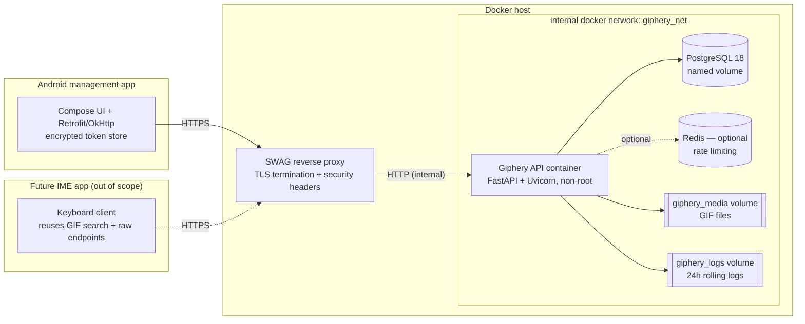

# ARCHITECTURE.md — Giphery

## 1. System overview



## 2. Component responsibilities

| Component | Responsibility |
|-----------|----------------|
| **SWAG** | TLS termination, HSTS + security headers, `client_max_body_size`, forwards real client IP (`X-Forwarded-For`), proxies to `api` on the internal network. |
| **Giphery API** | All business logic: auth, setup, invitations, GIF upload/validation/serving, tags, search, RBAC, audit logging. Serves the admin web UI (Jinja2 + HTMX). Runs as non-root. |
| **PostgreSQL 18** | Persistent relational store. Not exposed to the host. Least-privilege app role. |
| **Redis (optional)** | Distributed rate-limit counters when running >1 API node. Single-node falls back to in-process. |
| **giphery_media volume** | GIF binary files on disk, addressed by stored path; DB holds metadata. |
| **giphery_logs volume** | 24-hour rolling app + audit logs. |
| **Android app** | Pairing via invite code, gallery, upload/edit/delete, tagging, search, theme; transparent token refresh; encrypted refresh-token storage. |

## 3. Data model (PostgreSQL)

UUIDv7 (time-ordered) primary keys. Every table has `created_at timestamptz NOT NULL DEFAULT now()`; mutable tables also `updated_at timestamptz`.

### users
| Column | Type | Notes |
|--------|------|-------|
| id | uuid (v7) PK | |
| username | citext UNIQUE NOT NULL | case-insensitive unique |
| password_hash | text NOT NULL | Argon2id |
| display_name | text NULL | |
| role | text NOT NULL | `admin` \| `user`; CHECK constraint |
| is_active | boolean NOT NULL DEFAULT true | |
| created_at / updated_at | timestamptz | |

First account created via `/setup` is `admin`.

### invitations
| Column | Type | Notes |
|--------|------|-------|
| id | uuid (v7) PK | |
| code_encrypted | bytea NOT NULL | Fernet-encrypted plaintext code (admin can view) |
| code_lookup_hash | bytea NOT NULL UNIQUE | HMAC-SHA256(code) for O(1) redeem lookup without decrypting all rows |
| label | text NULL | admin's free-text "intended user" |
| created_by | uuid FK→users(id) NOT NULL | |
| max_uses | int NOT NULL DEFAULT 1 | CHECK ≥ 1 |
| uses_count | int NOT NULL DEFAULT 0 | |
| expires_at | timestamptz NULL | |
| revoked_at | timestamptz NULL | |
| redeemed_by | uuid FK→users(id) NULL | first/last redeemer (single-use → the user) |
| redeemed_at | timestamptz NULL | |
| created_at | timestamptz | |

Status (derived): `revoked` if `revoked_at`; else `expired` if `expires_at < now()`; else `redeemed` if `uses_count >= max_uses`; else `active`.

### devices
| Column | Type | Notes |
|--------|------|-------|
| id | uuid (v7) PK | |
| user_id | uuid FK→users(id) NOT NULL | ON DELETE CASCADE |
| name | text NOT NULL | username/identifier entered at pairing |
| refresh_jti | uuid NOT NULL UNIQUE | current refresh token id (rotates) |
| refresh_token_hash | text NOT NULL | SHA-256 of current refresh token |
| platform | text NULL | user-agent/platform string |
| last_seen_at | timestamptz NULL | |
| revoked_at | timestamptz NULL | per-device revocation |
| created_at | timestamptz | |

Index on `(user_id)`, unique on `refresh_jti`.

### gifs
| Column | Type | Notes |
|--------|------|-------|
| id | uuid (v7) PK | |
| owner_id | uuid FK→users(id) NOT NULL | ON DELETE CASCADE |
| stored_path | text NOT NULL | path within MEDIA_ROOT |
| original_filename | text NOT NULL | sanitized |
| content_hash | char(64) NOT NULL | sha256 hex |
| mime_type | text NOT NULL | validated, e.g. `image/gif` |
| byte_size | bigint NOT NULL | |
| width / height | int NOT NULL | |
| title | text NULL | |
| created_at / updated_at | timestamptz | |

`UNIQUE (owner_id, content_hash)` for per-owner dedupe. Index on `owner_id`; `pg_trgm` GIN index on `title`.

### tags
| Column | Type | Notes |
|--------|------|-------|
| id | uuid (v7) PK | |
| name | citext UNIQUE NOT NULL | normalized lowercase/trimmed |
| created_at | timestamptz | |

`pg_trgm` GIN index on `name` for autocomplete/search.

### gif_tags
| Column | Type | Notes |
|--------|------|-------|
| gif_id | uuid FK→gifs(id) ON DELETE CASCADE | |
| tag_id | uuid FK→tags(id) ON DELETE CASCADE | |
| PRIMARY KEY (gif_id, tag_id) | | many-to-many |

Index on `(tag_id)` for reverse lookup (gifs by tag).

### Extensions required
`citext`, `pg_trgm`, and (Postgres 18) native `uuidv7()` — Alembic migration enables them.

## 4. RBAC matrix

| Action | admin | user (owner) | user (non-owner) | anon |
|--------|:-----:|:------------:|:----------------:|:----:|
| `/setup` (first run only) | — | — | — | ✅ until first user exists |
| login / refresh / logout | ✅ | ✅ | ✅ | login only |
| create/list/revoke invites | ✅ | ❌ | ❌ | ❌ |
| redeem invite | — | — | — | ✅ (creates the user) |
| list/search gifs | all | own | own | ❌ |
| upload gif | ✅ | ✅ | — | ❌ |
| read gif metadata / raw | any | own | ❌ | ❌ |
| edit/delete gif | any | own | ❌ | ❌ |
| manage tags on a gif | any | own gif | ❌ | ❌ |

Ownership is enforced server-side on every mutating endpoint; client-supplied owner ids are ignored.

## 5. REST API contract

Base: `/api/v1`. JSON. Auth via `Authorization: Bearer <access_token>` unless noted.
Error envelope (all non-2xx):

```json
{ "error": { "code": "string_code", "message": "human readable", "details": null } }
```

### Auth & onboarding
| Method | Path | Auth | Request | Success | Errors |
|--------|------|------|---------|---------|--------|
| GET | `/health` | none | — | 200 `{status, db, time}` | 503 if not ready |
| GET | `/setup/status` | none | — | 200 `{setup_pending: bool}` | — |
| POST | `/setup` | none (first run) | `{username, password}` | 201 `{access_token, refresh_token, user}` | 409 if any user exists; 422 weak password |
| POST | `/auth/login` | none | `{username, password}` | 200 `{access_token, refresh_token}` | 401 generic; 429 rate-limited |
| POST | `/auth/refresh` | none | `{refresh_token}` | 200 `{access_token, refresh_token}` (rotated) | 401 invalid/revoked/reused |
| POST | `/auth/logout` | bearer | — | 204 | 401 |

`/auth/refresh` rotates: old `jti` invalidated; reuse of an old refresh token revokes the device (replay defense).

### Invitations (admin only)
| Method | Path | Request | Success | Notes |
|--------|------|---------|---------|-------|
| POST | `/invites` | `{label?, max_uses=1, expires_at?}` | 201 `{id, code, label, max_uses, expires_at, status, created_at}` | plaintext `code` returned **once** |
| GET | `/invites` | — | 200 `[{id, code, label, status, max_uses, uses_count, redeemed_by, redeemed_at, expires_at, created_at}]` | `code` decrypted for display |
| DELETE | `/invites/{id}` | — | 204 | sets `revoked_at` |
| POST | `/invites/redeem` | `{code, username}` | 201 `{access_token, refresh_token, user}` | **no auth**; used by Android |

`redeem` validates (active, not expired, uses remaining), creates the `user` with the supplied **username** (unique — 409 `username_taken` if not), creates a `device`, increments `uses_count`, sets `redeemed_by/at`.

### GIFs
| Method | Path | Request | Success | Notes |
|--------|------|---------|---------|-------|
| GET | `/gifs` | query: `q, tag, owner?(admin), sort, limit≤100, cursor` | 200 `{items:[GifMeta], next_cursor}` | search title+tags (`pg_trgm`) |
| POST | `/gifs` | multipart: `file`, `title?`, `tags?` | 201 `GifMeta` | Pillow-validated GIF, size-capped, hashed, deduped |
| GET | `/gifs/{id}` | — | 200 `GifMeta` | ownership/admin |
| GET | `/gifs/{id}/raw` | — | 200 GIF bytes | `Content-Type: image/gif`, caching + safe `Content-Disposition`; **IME endpoint** |
| PATCH | `/gifs/{id}` | `{title?, tags?}` | 200 `GifMeta` | replaces tag set if `tags` given |
| DELETE | `/gifs/{id}` | — | 204 | removes row **and** file |

`GifMeta`: `{id, owner_id, title, original_filename, mime_type, byte_size, width, height, content_hash, tags:[string], raw_url, created_at, updated_at}`.

### Tags
| Method | Path | Request | Success |
|--------|------|---------|---------|
| GET | `/tags` | `q?` | 200 `[{name, usage_count}]` (autocomplete) |
| POST | `/gifs/{id}/tags` | `{name}` | 200 `GifMeta` |
| DELETE | `/gifs/{id}/tags/{tag}` | — | 200 `GifMeta` |

### OpenAPI docs
`/docs` and `/redoc` are disabled unless `ENABLE_DOCS=true`; never enabled in production.

## 6. Invitation-code pairing & auth flow

```mermaid
sequenceDiagram
    participant A as Admin (web UI)
    participant S as Giphery API
    participant P as Android app
    Note over S: First launch — no users yet
    P->>S: GET /setup/status
    S-->>P: {setup_pending:true}
    A->>S: POST /setup {username,password}
    S->>S: Argon2id hash; create admin; lock setup
    S-->>A: 201 tokens + user
    A->>S: POST /invites {label:"Alice", max_uses:1}
    S->>S: gen code; encrypt at rest; HMAC lookup hash
    S-->>A: 201 {code:"ABCD-...", ...}  (shown once)
    Note over A,P: Admin gives code to Alice out-of-band
    P->>S: POST /invites/redeem {code, username:"alice"}
    S->>S: validate code; create user "alice" + device; issue jti
    S-->>P: 201 {access_token, refresh_token, user}
    P->>P: store refresh token encrypted (Keystore); access in memory
    loop access token expiry (~15m)
        P->>S: POST /auth/refresh {refresh_token}
        S->>S: verify jti; rotate (old jti invalid); update device
        S-->>P: 200 new {access_token, refresh_token}
    end
```

### Token model
- **Access JWT**: ~15 min, in-memory on the client. Claims: `sub` (user id), `role`, `jti`, `iat`, `exp`, `nbf`, `iss`, `aud`, `typ:"access"`.
- **Refresh JWT**: ~30–90 days (default 60), rotating. Claims include `jti` (matches `devices.refresh_jti`), `typ:"refresh"`. Stored encrypted on device; SHA-256 hash + jti stored server-side for verification and per-device revocation.
- **Signing**: HS256 with `SECRET_KEY` (default). RS256/EdDSA supported via config for multi-service deployments. All of `exp, iat, nbf, aud, iss` validated on every verify.
- **Revocation**: logout or admin action clears the device row / sets `revoked_at`; refresh fails. Refresh-token **reuse detection** (an old jti presented after rotation) revokes the device.

## 7. Storage layout for GIF files

- Files stored under `MEDIA_ROOT` (volume `giphery_media`), sharded by content hash:
  `MEDIA_ROOT/<hash[0:2]>/<hash[2:4]>/<hash>.gif`.
- DB `gifs.stored_path` holds the path **relative** to `MEDIA_ROOT` (never an absolute or client path).
- Dedupe: `UNIQUE(owner_id, content_hash)` — re-upload of identical bytes by the same owner returns the existing row (409 or idempotent 200, documented in the handler).
- Delete removes the DB row then the file; orphan-file sweep is a maintenance task.
- Files are served only through `/gifs/{id}/raw` after auth — the media volume is **not** web-root and not served statically.

## 8. Logging & observability (24-hour rolling log)

- **Goal:** a continuous, troubleshooting-grade record of everything the app does, automatically pruned to the last 24 hours.
- **Mechanism:** Python `logging` with a `TimedRotatingFileHandler` rotating **hourly** (`when="H"`, `interval=1`, `backupCount=LOG_RETENTION_HOURS` default 24) writing to `LOG_DIR` on the `giphery_logs` volume. Older files auto-deleted by the handler. Also echoed to stdout for `docker logs`.
- **Streams (same rotation policy):**
  - `giphery.access` — one line per HTTP request: method, path, status, latency_ms, client_ip (from `X-Forwarded-For`), `request_id`, `user_id` (if authenticated). Added by an ASGI middleware that assigns a `request_id` (UUID) and sets it on the response header `X-Request-ID`.
  - `giphery.app` — application/debug events, exceptions with stack traces.
  - `giphery.audit` — security events (login success/failure, setup, invite create/redeem/revoke, gif upload/delete, device revoke) with actor, action, target, source IP, timestamp.
- **Format:** structured JSON lines when `LOG_JSON=true` (default), else human text. A correlation `request_id` ties access/app/audit lines together.
- **Redaction:** a logging `Filter` strips/masks any field whose key matches a secret pattern (`password`, `token`, `secret`, `authorization`, `code`, `hash`). Tokens, password hashes, and invite codes are **never** written.
- **Levels:** controlled by `LOG_LEVEL`; request + audit lines always emitted at INFO regardless.

## 9. Deployment topology

- API listens on the **internal** docker network (`giphery_net`) only; never published to the host.
- SWAG (separate compose project on a shared external network) terminates TLS and proxies to `api:8000`.
- `db` and `redis` are internal-only; `db` uses a named volume; GIFs on `giphery_media`; logs on `giphery_logs`.
- All config via env (`.env`). See README for the SWAG site-conf snippet and network wiring.

## 10. Decision log

| # | Decision | Rationale | Alternatives considered |
|---|----------|-----------|-------------------------|
| 1 | **Jinja2 server-rendered** admin UI (no external JS/HTMX), not a React SPA | Minimal attack surface: no CDN, no inline scripts (strict CSP holds), forms work without JS, cookie-based auth with httpOnly tokens + double-submit CSRF, fewer deps to vuln-scan | React 19 + Vite SPA (larger surface); HTMX via CDN (CSP/script-src friction) |
| 2 | **Encrypt invite codes at rest** (Fernet) + HMAC lookup hash | Requirement: admin must view codes later; encryption lets the UI decrypt-and-display while DB holds no plaintext; HMAC enables O(1) redeem lookup | Store-hash-only + show-once (loses view-later); config flag offers this mode |
| 3 | **HS256** JWT default | Single-service deployment; simple strong shared secret; RRS256/EdDSA available via config | Always asymmetric (unneeded ops overhead for one node) |
| 4 | **UUIDv7** PKs | Time-ordered → good index locality, non-enumerable, native in PG18 | bigserial (enumerable), UUIDv4 (index fragmentation) |
| 5 | **Per-owner content-hash dedupe** | Avoids storing identical bytes per user; preserves per-user ownership/privacy | Global dedupe (cross-user file sharing leaks existence) |
| 6 | **Hourly rotation, 24 backups** for the rolling log | Meets "24-hour rolling log" requirement with bounded disk; simple stdlib handler, no extra infra | size-based rotation (less predictable window); external log stack (overkill) |
| 7 | **slowapi**, Redis optional | Works in-process for single node; Redis only when scaling out | Always-Redis (extra required dependency) |
